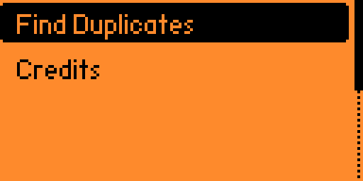
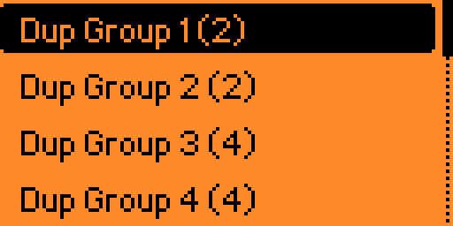
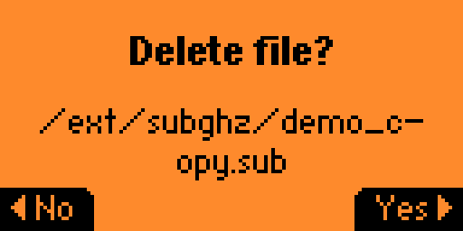

# Sub-GHz Duplicate Finder for Flipper Zero

An application for Flipper Zero to identify, manage, and clean up duplicate `*.sub` files from Sub-GHz storage.

## Screenshots

| Main Menu | Groups View | File Management |
| :---: | :---: | :---: |
|  |  |  |

## Usage

- **Choose the folder**: from the main menu, select "Folder: <name>" to open a folder browser
  starting at the currently chosen folder. Select a subfolder to move into it, ".." to go up
  (not above the SD card root), or "[Use this folder]" to pick the folder shown in the header
  and return to the main menu without scanning. The choice is saved to the SD card and
  remembered on the next launch; it falls back to `/ext/subghz` if nothing was saved yet, or
  the saved folder is missing or invalid.
- **Find Duplicates** scans only the chosen folder, one level deep (subfolders are not
  scanned), and only considers `*.sub` files (case-insensitive).
- Up to 128 `.sub` files are kept; reaching that limit stops the scan and the result says
  "Stopped at 128". A file that can't be read, or whose name doesn't fit, is skipped rather
  than guessed at and doesn't count towards that limit; the skipped counts are shown after
  the scan.
- **Delete** removes the selected file from the SD card. If the delete fails, the file stays
  in the list and a "Delete failed" message is shown instead.

## Development Setup

This project uses a standard `Makefile` for local development on your host machine (Linux/macOS).

### Requirements

- `gcc`, `make`, `clang-format`, `cppcheck`.

### Commands

- `make test`: Run unit tests for the core logic on your computer.
- `make format`: Automatically format code using `clang-format`.
- `make linter`: Run static analysis with `cppcheck`.
- `make prepare`: Links your local project directory into the Flipper Zero firmware `applications_user` folder.
- `make fap`: Builds the `.fap` binary using `fbt` (requires firmware repo).
- `make clean`: Cleans local build artifacts.

## Building for Flipper Zero

This project builds with [`ufbt`](https://github.com/flipperdevices/flipperzero-ufbt), the same
tool CI uses to build the `.fap` on every pull request and push to `main`:

1. Install `ufbt` (`pip install ufbt`).
2. Run `ufbt` from this project's directory to build the `.fap`.

`make fap` remains available as an alternative if you already have a full firmware checkout;
set `FLIPPER_FIRMWARE_PATH` in the `Makefile` to point to it.

## Project Structure

| File | Responsibility |
| --- | --- |
| `logic.h` / `logic.c` | Pure domain logic: CRC32, duplicate detection, record removal, scan decisions. No Flipper SDK dependency, testable with plain `gcc`. |
| `app_state.h` | App state struct, view enums, shared constants (`DEFAULT_SCAN_DIR`). |
| `storage_helper.h` / `.c` | File I/O: directory scanning, folder listing, file hashing, file deletion. |
| `settings.h` / `.c` | Loads and saves the chosen scan folder (`/ext/apps_data/sub_dup_finder/folder.txt`). |
| `ui.h` / `ui.c` | UI callbacks, rendering, view setup. |
| `main.c` | App lifecycle orchestration: alloc, setup, run, free. |
| `version.h` | App version, auto-updated by release-please. |

## CI/CD

This project includes GitHub Actions workflows:

- **CI** (`ci.yml`): Runs on every pull request and on pushes to `main`.
  1. Linter (static analysis with `cppcheck`).
  2. Format check (style enforcement with `clang-format`).
  3. Unit tests (logic validation).
  4. Build FAP (compiles with `ufbt`).

- **Release** (`release.yml`): Runs on push to `main`.
  1. Runs CI checks.
  2. [release-please](https://github.com/googleapis/release-please-action) creates a release PR with auto-generated changelog.
  3. On release, builds the `.fap` binary with `ufbt` and uploads it as a GitHub Release asset.

## Credits
Author: Endika
GitHub: [github.com/endika/flipper-sub-dup](https://github.com/endika/flipper-sub-dup)
